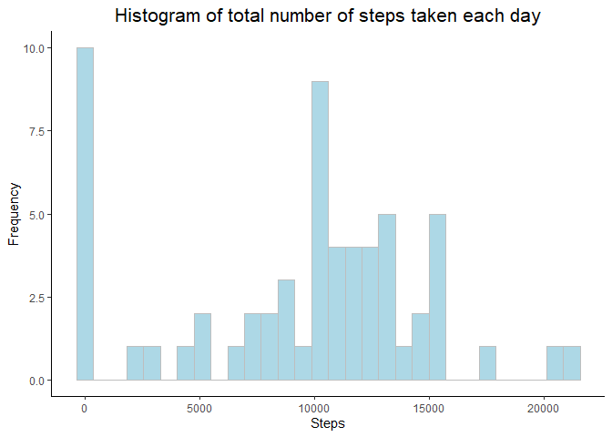
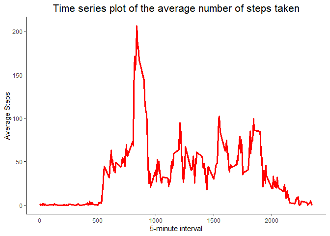
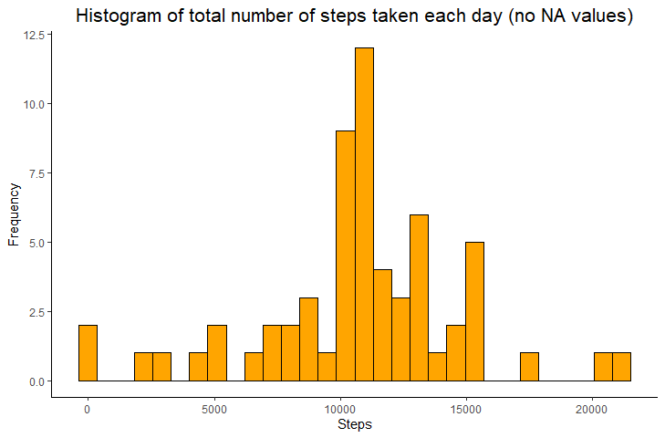
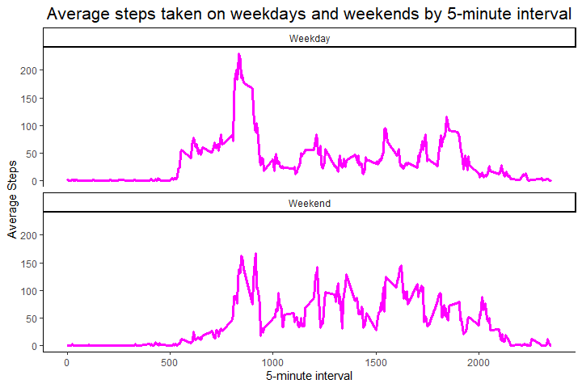

Reproducible Research Assignment
================

# Introduction

It is now possible to collect a large amount of data about personal
movement using activity monitoring devices such as a Fitbit, Nike
Fuelband, or Jawbone Up. These type of devices are part of the
“quantified self” movement – a group of enthusiasts who take
measurements about themselves regularly to improve their health, to find
patterns in their behavior, or because they are tech geeks. But these
data remain under-utilized both because the raw data are hard to obtain
and there is a lack of statistical methods and software for processing
and interpreting the data.

This assignment makes use of data from a personal activity monitoring
device. This device collects data at 5 minute intervals through out the
day. The data consists of two months of data from an anonymous
individual collected during the months of October and November, 2012 and
include the number of steps taken in 5 minute intervals each day.

The data for this assignment can be downloaded from the course web site:

Dataset: [Activity monitoring
data](https://d396qusza40orc.cloudfront.net/repdata%2Fdata%2Factivity.zip)

The variables included in this dataset are:

- steps: Number of steps taking in a 5-minute interval (missing values
  are coded as NA)
- date: The date on which the measurement was taken in YYYY-MM-DD format
- interval: Identifier for the 5-minute interval in which measurement
  was taken

The dataset is stored in a comma-separated-value (CSV) file and there
are a total of 17,568 observations in this dataset.

# Analysis

### Attaching the relevant packages

``` r
library(ggplot2)
```

    ## Warning: package 'ggplot2' was built under R version 4.2.3

``` r
library(dplyr)
```

    ## Warning: package 'dplyr' was built under R version 4.2.3

    ## 
    ## Attaching package: 'dplyr'

    ## The following objects are masked from 'package:stats':
    ## 
    ##     filter, lag

    ## The following objects are masked from 'package:base':
    ## 
    ##     intersect, setdiff, setequal, union

### Downloading and extracting the files

Downloading and unzipping the data, loading the data (i.e.read.csv())
and processing into a format suitable for our analysis (i.e. date
formatting)

``` r
if(!file.exists("./data")){dir.create("./data")}
fileUrl <- "https://d396qusza40orc.cloudfront.net/repdata%2Fdata%2Factivity.zip"
download.file(fileUrl, destfile = paste0(getwd(), "./data/activity.zip"), method = "libcurl")
unzip("./data/activity.zip",exdir = "data")
activity <- read.csv("./data/activity.csv")

activity$date <- as.Date(activity$date)
```

### What is mean total number of steps taken per day?

1.  Calculate the total number of steps taken per day

``` r
histdata <- activity %>% group_by(date) %>% summarize(allsteps = sum(steps, na.rm = TRUE))
```

2.  Histogram of the total number of steps taken each day

``` r
ggplot(histdata, aes(x = allsteps)) +
  geom_histogram(fill = "lightblue", color = "grey") +
  labs(title = "Histogram of total number of steps taken each day",
       x = "Steps",
       y = "Frequency") +
  theme_classic() +
  theme(plot.title = element_text(hjust = 0.5, size = 16))
```

    ## `stat_bin()` using `bins = 30`. Pick better value with `binwidth`.

<!-- -->

3.  Calculate the mean and median number of steps taken per day

``` r
meansteps <- round(mean(histdata$allsteps))
mediansteps <- round(median(histdata$allsteps))
```

The mean of total number of steps taken per day is 9354, while the
median is 10395.

### What is the average daily activity pattern?

1.  Time series plot of the 5-minute interval (x-axis) and the average
    number of steps taken

``` r
intervaldata <- activity %>% group_by(interval) %>% summarize(meansteps = mean(steps, na.rm = TRUE))

ggplot(intervaldata, aes(x = interval, y = meansteps)) +
  geom_line(color = "red", linewidth = 1.2) +
  labs(title = "Time series plot of the average number of steps taken",
       x = "5-minute interval",
       y = "Average Steps") +
  theme_classic() +
  theme(plot.title = element_text(hjust = 0.5, size = 16))
```

<!-- -->

2.  Which 5-minute interval, on average across all the days in the
    dataset, contains the maximum number of steps?

``` r
fivemininterval <- intervaldata$interval[which.max(intervaldata$meansteps)]

print(paste("The 5-minute interval containing the maximum number of steps is", fivemininterval))
```

    ## [1] "The 5-minute interval containing the maximum number of steps is 835"

The 5-minute interval containing the maximum number of steps is 835.

### Imputing missing values

1.  Calculate and report the total number of missing values in the
    dataset (i.e. the total number of rows with NA)

``` r
colSums(is.na(activity))
```

    ##    steps     date interval 
    ##     2304        0        0

2.  Devise a strategy for filling in all of the missing values in the
    dataset.
3.  Create a new dataset that is equal to the original dataset but with
    the missing data filled in.

``` r
newactivity <- activity

newactivity$steps[is.na(newactivity$steps)] <- tapply(newactivity$steps,newactivity$interval, mean, na.rm = TRUE)
```

4.  Make a histogram of the total number of steps taken each day (after
    missing values are imputed) and calculate and report the mean and
    median total number of steps taken per day.

``` r
histnewdata <- newactivity %>% group_by(date) %>% summarize(allsteps = sum(steps, na.rm = TRUE))

ggplot(histnewdata, aes(x = allsteps)) +
  geom_histogram(fill = "orange", color = "black") +
  labs(title = "Histogram of total number of steps taken each day (no NA values)",
       x = "Steps",
       y = "Frequency") +
  theme_classic() +
  theme(plot.title = element_text(hjust = 0.5, size = 16))
```

    ## `stat_bin()` using `bins = 30`. Pick better value with `binwidth`.

<!-- -->

``` r
newmeansteps <- round(mean(histnewdata$allsteps))
newmediansteps <- round(median(histnewdata$allsteps))
```

With the missing values imputed, the mean of total number of steps taken
per day is 10766, while the median is 10766.

### Are there differences in activity patterns between weekdays and weekends?

1.  Create a new factor variable in the dataset with two levels -
    “weekday” and “weekend”, indicating whether a given date is a
    weekday or a weekend day.

``` r
newactivity$weekday <- weekdays(newactivity$date)

newactivity$day <- case_when(newactivity$weekday %in% c('Saturday','Sunday') ~ 'Weekend', TRUE ~ 'Weekday')
newactivity$day <- as.factor(newactivity$day)
newactivity <- newactivity %>% group_by(interval, day) %>% summarize(steps = mean(steps))
```

    ## `summarise()` has grouped output by 'interval'. You can override using the
    ## `.groups` argument.

2.  Make a panel plot containing a time series plot of the 5-minute
    interval (x-axis) and the average number of steps, averaged across
    weekday days or weekend days (y-axis).

``` r
ggplot(newactivity, aes(x = interval, y = steps)) +
  facet_wrap(~day, nrow = 2, ncol = 1) +
  geom_line(color = "magenta", linewidth = 1.2) +
  labs(title = "Average steps taken on weekdays and weekends by 5-minute interval",
       x = "5-minute interval",
       y = "Average Steps") +
  theme_classic() +
  theme(plot.title = element_text(hjust = 0.5, size = 16))
```

<!-- -->
